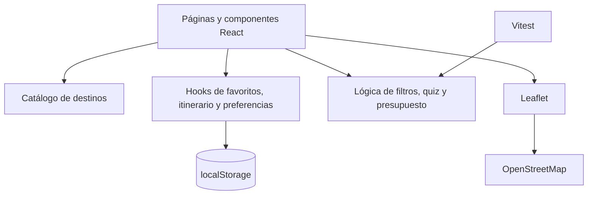
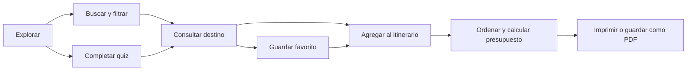

# SafeTravel

SafeTravel es una aplicación web universitaria orientada a descubrir y planificar experiencias turísticas en la región Ica, Perú. Combina un catálogo filtrable, un recomendador basado en preferencias, favoritos persistentes, un itinerario con presupuesto y mapas interactivos.

## Objetivo

Ayudar al viajero a elegir experiencias de acuerdo con sus intereses, provincia y presupuesto, ofreciendo información práctica para una visita más organizada y responsable.

## Funcionalidades

- Buscador por nombre, descripción o tipo de experiencia.
- Filtros por provincia, presupuesto y categoría.
- Recomendador turístico de cinco preguntas.
- Resultado con compatibilidad y segunda alternativa.
- Favoritos persistentes mediante `localStorage`.
- Itinerario ordenable con fecha, viajeros y notas.
- Cálculo de presupuesto por persona y grupo.
- Fichas individuales con clima, horarios, acceso, seguridad y accesibilidad.
- Mapas interactivos con Leaflet y OpenStreetMap.
- Diseño responsive y página 404 personalizada.
- Pruebas automatizadas de la lógica principal.

## Tecnologías

| Tecnología | Uso |
| --- | --- |
| React 18 | Interfaz y estado de la aplicación |
| Vite 5 | Desarrollo y compilación |
| React Router 6 | Navegación y rutas dinámicas |
| Leaflet / React Leaflet | Mapas interactivos |
| AOS | Animaciones al desplazarse |
| React Icons | Iconografía |
| Vitest | Pruebas automatizadas |
| CSS / SCSS | Estilos y diseño responsive |

## Requisitos

- Node.js 20 o superior recomendado.
- npm 10 o superior.
- Conexión a internet para descargar dependencias y mostrar los mosaicos de OpenStreetMap.

## Instalación

```bash
git clone <URL_DEL_REPOSITORIO>
cd safetravel
npm install
npm run dev
```

Vite mostrará una dirección local, normalmente `http://localhost:5173`.

## Comandos

```bash
npm run dev        # servidor de desarrollo
npm run build      # versión optimizada en dist/
npm run preview    # previsualizar la compilación
npm run lint       # validar calidad de JavaScript y JSX
npm run test       # ejecutar todas las pruebas una vez
npm run test:watch # ejecutar pruebas mientras se programa
```

## Arquitectura



## Flujo del usuario



## Estructura principal

```text
src/
├── Components/     Componentes reutilizables
├── View/           Páginas de la aplicación
├── assets/         Imágenes, vídeo e iconos
├── data/           Catálogo turístico centralizado
├── hooks/          Persistencia y estado reutilizable
├── lib/            Datos antiguos, utilidades y pruebas
├── App.jsx
└── AppRoutes.jsx
```

## Modelo turístico

Cada destino contiene:

- Identidad, slug y provincia.
- Categoría, precio, duración y valoración.
- Descripción y actividades destacadas.
- Coordenadas.
- Clima y temporada recomendada.
- Horario y forma de acceso.
- Seguridad, accesibilidad y elementos sugeridos.
- Fuente institucional de referencia.

## Fuentes de referencia

- [PROMPERÚ — Destino Ica](https://meetings.peru.travel/es/destinos/ica)
- [SERNANP — Reserva Nacional de Paracas](https://visitaareasnaturales.sernanp.gob.pe/anps/reserva-nacional-de-paracas/)
- [UNESCO — Líneas y Geoglifos de Nasca y Palpa](https://whc.unesco.org/en/list/700)
- [MINCETUR — Casa Hacienda San José](https://consultasenlinea.mincetur.gob.pe/fichaInventario/index.aspx?cod_Ficha=242)
- [OpenStreetMap](https://www.openstreetmap.org/copyright)

Los precios y horarios mostrados son referenciales. Deben confirmarse con las instituciones u operadores formales antes de viajar.

## Persistencia

Esta versión no utiliza backend. Favoritos, itinerario y preferencias se almacenan en el navegador mediante `localStorage`. Los datos no se sincronizan entre dispositivos ni representan una reserva comercial.

## Pruebas

Las pruebas unitarias cubren:

- Combinación de filtros.
- Resultado y compatibilidad del quiz.
- Agregar y eliminar identificadores.
- Reordenar actividades.
- Presupuesto por cantidad de viajeros.

## Próximos pasos

- Pruebas de componentes y navegación.
- Integración con Supabase o API propia.
- Autenticación y sincronización entre dispositivos.
- Panel de administración de destinos.
- Revisión periódica de precios, horarios y fuentes.
- Despliegue público en Vercel o Netlify.

## Alcance académico

SafeTravel nació como proyecto universitario y actualmente funciona como prototipo frontend. No procesa pagos, reservas ni datos personales sensibles.
